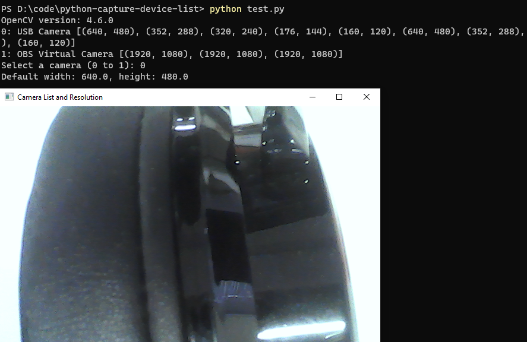

# List Capture Devices for Python OpenCV on Windows
**OpenCV** does not have an API for listing capture devices. The sample shows how to create a Python extension to invoke DirectShow C++ APIs for enumerating capture devices.

## Environment
* [Microsoft Windows SDK][0]
* Python 2.7.9 / Python 3.6.5
* OpenCV 3.3.0

## How to Run 
1. Configure Visual Studio environment:
    * Visual Studio 2010 (VS10): SET VS90COMNTOOLS=%VS100COMNTOOLS%
    * Visual Studio 2012 (VS11): SET VS90COMNTOOLS=%VS110COMNTOOLS%
    * Visual Studio 2013 (VS12): SET VS90COMNTOOLS=%VS120COMNTOOLS%
    * Visual Studio 2015 (VS14): SET VS90COMNTOOLS=%VS140COMNTOOLS%

    If you are using **Visual Studio 2015**, use the following command:

    ```
    SET VS90COMNTOOLS=%VS140COMNTOOLS%
    ```

2. Add your Windows SDK lib path to **setup.py**:

    ```python
    from distutils.core import setup, Extension

    module_device = Extension('device',
                            sources = ['device.cpp'], 
                            library_dirs=['G:\Program Files\Microsoft SDKs\Windows\v6.1\Lib']
                        )

    setup (name = 'WindowsDevices',
            version = '1.0',
            description = 'Get device list with DirectShow',
            ext_modules = [module_device])
    ```

3. Build the Python extension

    Python 2

    ```
    python setup.py build install
    ```

    Python 3

    ```
    python3 setup.py build install
    ```

4. Run the app and select a capture device:

    Python 2

    ```python
    python test.py
    ```

    Python 3
    ```python
    python3 test.py
    ```
    

## Blog
[Listing Multiple Cameras for OpenCV-Python on Windows][1]

[0]:https://en.wikipedia.org/wiki/Microsoft_Windows_SDK
[1]:http://www.codepool.biz/multiple-camera-opencv-python-windows.html
